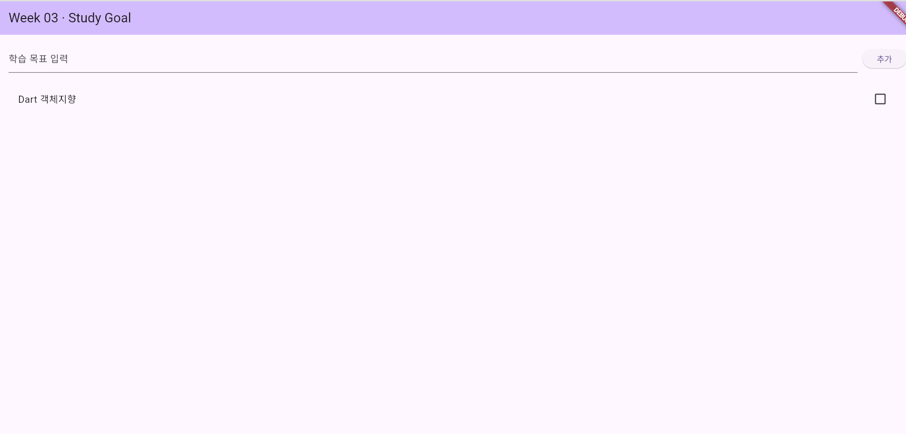
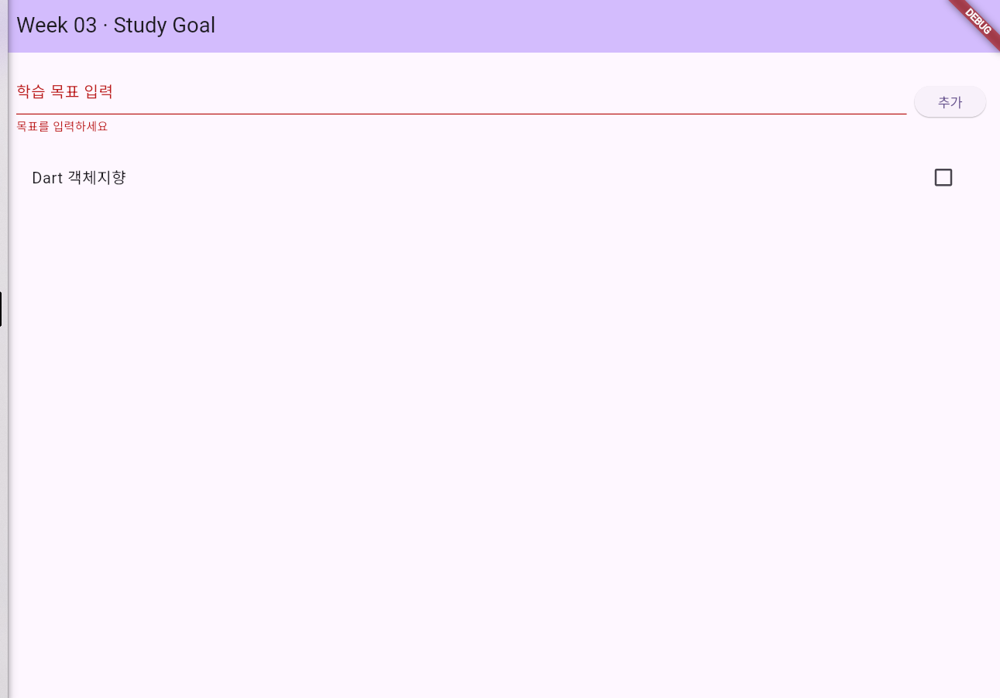
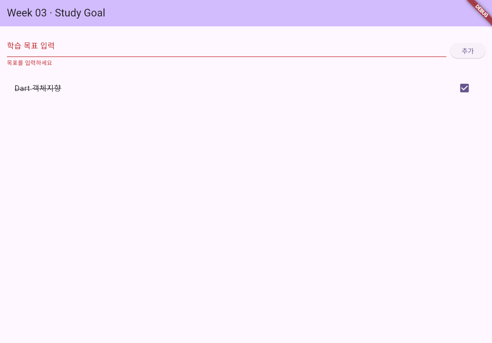

# 📌 week03_goal_lab - StudyGoal 과제

Flutter를 활용하여 주차별 학습 목표를 등록하고 완료 상태를 관리하는 애플리케이션입니다.

---

## 📄 요구사항 명세 (Feature Context)

상세한 사용자 스토리, 기능 범위, 수용조건(AC)은 아래 문서에서 확인하실 수 있습니다.
👉 **[FEATURE_CONTEXT.md 보러가기](./FEATURE_CONTEXT.md)**

---

## 📸 수용조건(AC) 실행 증거

| AC1: 정상 추가 | AC2: 빈 값 오류 | AC3: 완료 토글 |
| :---: | :---: | :---: |
|  |  |  |

---

## 🛠️ 주요 기능
1. **학습 목표 추가 (`_addGoal`)**: 텍스트를 입력하고 추가 버튼 클릭 시 목록에 미완료 상태로 등록
2. **빈 값 입력 예외 처리**: 공백 입력 시 `"목표를 입력하세요"` 에러 메시지 표시
3. **완료 상태 토글 (`_toggleGoal`)**: 체크박스 클릭 시 텍스트에 취소선 적용 및 상태 전환

---

## 🔗 제출 정보
- **GitHub Repository**: https://github.com/chuns3hun/week03_goal_lab
- **Commit ID**: `eb5673a` (또는 `d569671`)
- **Commit Message**: `feat: complete study goal acceptance criteria`
